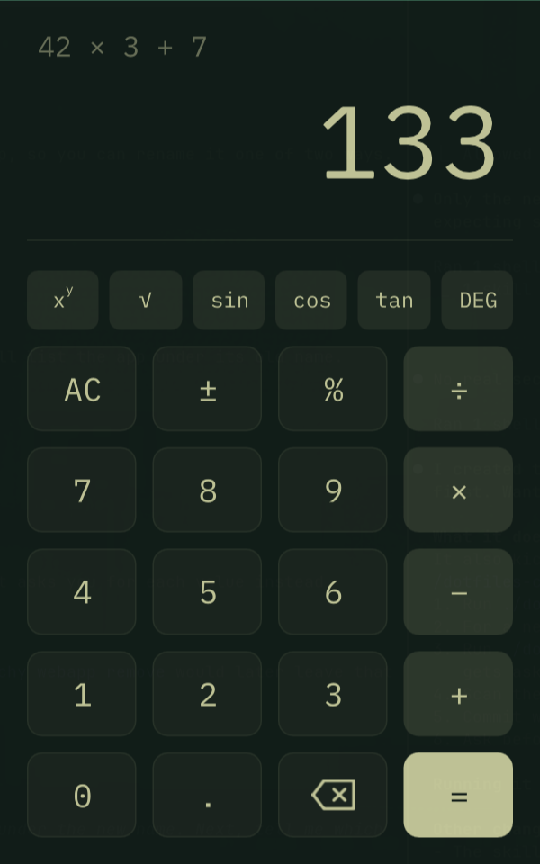

# Getting started

## Pages

A page is a `.md` file. Its **title** is the first `# Heading` in the file, and the file name
is a slug: this page is `getting-started.md` but shows as "Getting started".

Folders group pages. The tree on the left mirrors the folder structure, and the breadcrumbs
above the page show where it lives. Give a folder an `index.md` and it stands for the folder:
opening the folder shows it, and a link to the folder opens it too: [[/notes]].

## Links

Link to another page with double brackets and its path from the wiki root, without the
`.md` extension:

```markdown
[[notes/markdown-cheatsheet]]
[[notes/markdown-cheatsheet|the cheatsheet]]
```

The first form shows the page's title: [[notes/markdown-cheatsheet]]. The second shows your
own text: [[notes/markdown-cheatsheet|the cheatsheet]]. A link to a page that does not exist
yet looks like this: [[notes/not-written-yet]] — press `Enter` on it and wikiBits offers to
create the page.

Ordinary Markdown links work too, both to pages ([the home page](index.md)) and to the web
([ratatui](https://ratatui.rs)). The **Related** column on the right lists this page's
headings, the pages it links to, and the pages that link here.

## Images

Images render inline, scaled down to fit the page. Select one with `n`/`p` (or click it) and
press `Enter` to see it full size:



## Editing

`e` opens the page's Markdown in a plain editor: type, `Shift`+arrows to select, `Ctrl-C/X/V`,
`Ctrl-Z/Y`, `[[` suggests pages, `Ctrl-P` inserts an image, `Ctrl-S` saves. `N` creates a page,
`C` a child of the current page, `R` renames, `D` deletes (to `.trash/`).

## Keys

| Key | Action |
|-----|--------|
| `Tab` | move between the three columns |
| `j` / `k` | move or scroll |
| `n` / `p` | select the next / previous link, image or task |
| `Enter` | open the selected page, link or image; tick a task |
| `b` / `f` | back / forward |
| `/` | find in this page |
| `s` | search the whole wiki |
| `e` | edit this page |
| `?` | all keys |
